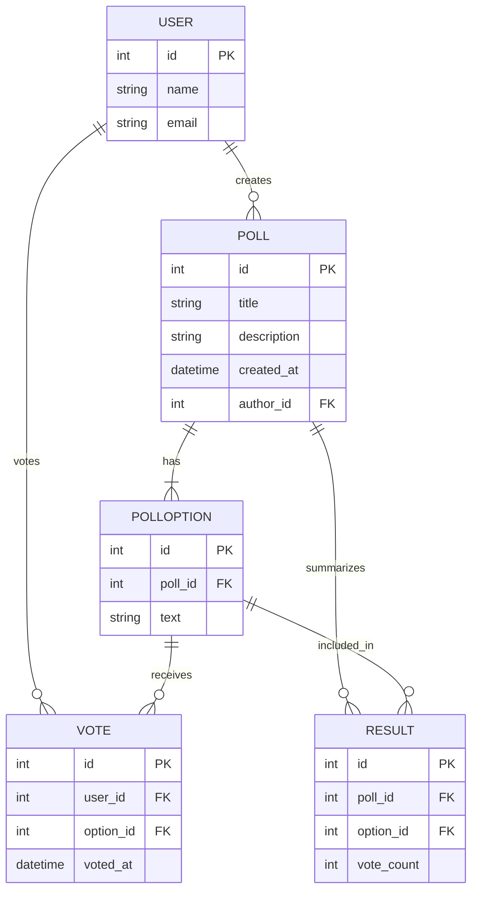

# KuraNet

## Overview
Its an Online Polling System API that allows users to create and participate in polls. The API is built using Django Rest Framework and provides endpoints for user authentication, poll management, voting, and results display.

## Table of contents


## Features

- **User Authentication**: Secure login and registration for users.
- **Poll Creation**: Users can create polls with multiple options.
- **Poll Participation**: Users can vote on existing polls.
- **Results Display**: Real-time results of polls are displayed to users.
- **Admin Panel**: Admins can manage users and polls.

# KuraNet


## Overview
It's an Online Polling System API that allows users to create and participate in polls. The API is built using Django Rest Framework and provides endpoints for user authentication, poll management, voting, and results display.

## Features

- **User Authentication**: Secure login and registration for users.
- **Poll Creation**: Users can create polls with multiple options.
- **Poll Participation**: Users can vote on existing polls.
- **Results Display**: Real-time results of polls are displayed to users.
- **Admin Panel**: Admins can manage users and polls.

## 📊 Entity Relationship Diagram (ERD)



## 🚧 Setup Git Hooks (Required)

Run this after cloning:

```bash
./tools/git-hooks/setup-hooks.sh
```

## 🛠️ Development Setup

### Prerequisites to To develop stress free

NB: Use GitFlow to manage your branches and commits.

### setup GitFlow

- Install GitFlow if not already installed:
    1. For macOS users, you can use Homebrew:

   
    ```bash
    brew install git-flow
    ```

    2. For Ubuntu users, you can use apt:

    ```bash
    sudo apt-get install git-flow
    ```

    3. For Windows users, you can download the installer from the [GitFlow GitHub repository](https://github.com/nvie/gitflow).

- Initialize GitFlow in your repository:

    ```bash
    git flow init
    ```

### Clone the Repository

```bash
git clone https://github.com/AbuArwa001/kuranet.git
cd kuranet
```

### Install Dependencies
# Create a virtual environment

```bash
python3 -m venv venv
```

# Activate the virtual environment


```bash
source .venv/bin/activate
```

# Install dependencies

```bash
pip install -r requirements.txt
```

## 🏃 Running the Application

```bash
# Run database migrations
python manage.py migrate
```

# Start the development server

```bash
python manage.py runserver
```

